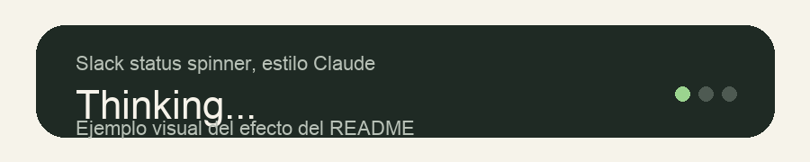

# Slack Status Spinner Verbs

¿Alguna vez has querido que tu status de Slack se vea como el spinner de Claude cuando está pensando?

Este proyecto crea ese efecto de forma local: rota tu estado personalizado de Slack cada 10 segundos usando los verbos de `spinner_verbs.txt`, con un estilo tipo `Thinking...`, `Reasoning...`, `Analyzing...`.

## Vista previa



## Qué hace

- Actualiza únicamente tu propio estado de Slack
- Usa un token de usuario de Slack, no un bot
- Cambia el texto del estado en formato `Verbo...`
- Lee los verbos desde un archivo de texto plano
- Restaura tu estado anterior al detenerse correctamente
- Define expiración corta para evitar que el estado se quede pegado si el proceso muere
- Registra cada actualización en consola o en log

## Por qué esta implementación

Slack permite actualizar el estado personalizado del usuario con `users.profile.set`, pero para eso necesitas un token de usuario con el scope `users.profile:write`. Por eso este proyecto usa la API oficial de Slack y el SDK oficial de Python.

El orden por defecto es `rotate` porque reparte los verbos de forma pareja, es predecible y facilita probar cambios. Si prefieres comportamiento aleatorio, puedes usar `VERB_ORDER=random`.

## Limitaciones y consideraciones

- Solo actualiza tu propio estado.
- Requiere un token de usuario de Slack, normalmente con prefijo `xoxp-`.
- Si detienes el proceso con `Ctrl+C` o con `./slack_spinner stop`, intenta restaurar el estado anterior.
- Si la máquina se apaga o el proceso muere de forma abrupta, no puede restaurar tu estado anterior; por eso cada actualización se envía con expiración corta.
- Slack aplica límites a las actualizaciones de perfil. Este proyecto actualiza cada 10 segundos, que sigue por debajo del límite documentado de 10 actualizaciones por minuto por usuario.
- Si notas un pequeño retraso visual entre cambios, normalmente viene del cliente de Slack o de la propagación del cambio en Slack, no de un `clear` previo en este script.

## Estructura del proyecto

```text
.
├── .env.example
├── .gitignore
├── README.md
├── requirements.txt
├── slack_spinner
├── slack_status_spinner.py
└── spinner_verbs.txt
```

## Cómo generar el token de Slack

Necesitas un `User OAuth Token`, no un bot token.

### Opción recomendada: crear una app desde Slack

1. Entra a `https://api.slack.com/apps`
2. Haz clic en `Create New App`
3. Elige `From scratch`
4. Ponle nombre a la app y selecciona tu workspace
5. En el menú lateral entra a `OAuth & Permissions`
6. En `User Token Scopes`, agrega estos scopes:
   - `users.profile:read`
   - `users.profile:write`
7. Haz clic en `Install to Workspace` o `Reinstall to Workspace`
8. Autoriza la app con tu usuario
9. En esa misma pantalla copia el `User OAuth Token`

Ese token es el que debes guardar en `.env` como:

```env
SLACK_USER_TOKEN=xoxp-...
```

### Qué token sí usar

- `User OAuth Token`
- normalmente empieza con `xoxp-`

### Qué tokens no usar

- `Bot User OAuth Token` (`xoxb-...`)
- `App-Level Tokens`
- `Client ID`
- `Client Secret`
- `Signing Secret`
- `Verification Token`

### Si no aparece el `User OAuth Token`

Normalmente pasa por una de estas razones:

- no agregaste scopes en `User Token Scopes`
- no reinstalaste la app al workspace después de agregar los scopes
- tu workspace requiere aprobación de un admin para instalar apps

## Setup local

1. Crea un entorno virtual:

   ```bash
   python3 -m venv .venv
   ```

2. Actívalo:

   ```bash
   source .venv/bin/activate
   ```

3. Instala dependencias:

   ```bash
   pip install -r requirements.txt
   ```

4. Crea tu archivo de entorno local:

   ```bash
   cp .env.example .env
   ```

5. Edita `.env` y pega tu token:

   ```env
   SLACK_USER_TOKEN=xoxp-...
   ```

## Ejecutar directo

Si quieres correrlo en foreground y ver los logs en la terminal:

```bash
source .venv/bin/activate
python slack_status_spinner.py
```

## Ejecutar con el comando helper

Para manejarlo más fácil, usa el wrapper local incluido:

```bash
chmod +x slack_spinner
./slack_spinner start
```

Comandos disponibles:

- `./slack_spinner start`: inicia el spinner en background
- `./slack_spinner stop`: lo detiene limpiamente e intenta restaurar tu estado anterior
- `./slack_spinner restart`: reinicia el spinner
- `./slack_spinner status`: muestra si está corriendo

Archivos runtime:

- `.slack_spinner.log`: log del proceso
- `.slack_spinner.pid`: PID del proceso en background

Uso típico:

```bash
./slack_spinner start
./slack_spinner status
tail -f .slack_spinner.log
./slack_spinner stop
```

## Validar que el proyecto está bien configurado

Antes de usarlo o después de cambiar la configuración, puedes correr estas validaciones:

```bash
python3 -m py_compile slack_status_spinner.py
./.venv/bin/python -m unittest discover -s tests -v
```

Qué validan esos tests:

- que la lógica principal del spinner siga funcionando
- que el restore del estado siga bien
- que `.env` y `.env.example` tengan las mismas variables
- que `.env.example` siga alineado con la configuración soportada por el script
- que `spinner_verbs.txt` tenga verbos válidos
- que el wrapper `slack_spinner` no tenga errores de sintaxis shell

## Configuración

Toda la configuración es local y por variables de entorno:

- `SLACK_USER_TOKEN`: token de usuario de Slack con `users.profile:read` y `users.profile:write`
- `STATUS_EMOJI`: emoji del estado, por ejemplo `:thought_balloon:`
- `STATUS_PREFIX`: texto opcional antes del verbo
- `STATUS_SUFFIX`: texto opcional después del verbo. Default: `...`
- `UPDATE_INTERVAL_SECONDS`: cada cuánto cambia el estado. Default: `10`
- `STATUS_EXPIRATION_SECONDS`: expiración automática como fallback si el proceso muere. Debe ser mayor que el intervalo. Default: `40`
- `VERB_ORDER`: `rotate` o `random`
- `VERBS_FILE`: ruta al archivo de verbos. Default: `spinner_verbs.txt`

Ejemplos:

- con la configuración por defecto: `Thinking...`
- si `STATUS_PREFIX=Still`: `Still Thinking...`

## Archivo de verbos

`spinner_verbs.txt` es un archivo de texto plano con un verbo por línea.

Reglas:

- las líneas vacías se ignoran
- las líneas que empiezan con `#` se ignoran
- puedes comentar verbos temporalmente para probar distintas listas

## Comportamiento al apagar

- al arrancar, el script lee y guarda tu estado actual
- durante la ejecución, cada actualización se envía con expiración corta
- al recibir `Ctrl+C` o `SIGTERM`, intenta restaurar el estado original
- si el estado original ya habría expirado al momento de detenerse, lo limpia en vez de restaurar un valor vencido

## Manejo de errores

El script contempla los casos más importantes para uso local:

- rate limits: espera el `Retry-After` devuelto por Slack y reintenta
- token inválido, expirado o revocado: termina con error claro
- falla de red o error transitorio del cliente: reintenta con backoff
- archivo de verbos vacío o inválido: termina antes de cambiar nada
- falla al restaurar el estado: lo registra en logs y confía en la expiración corta como respaldo

## Notas de la API de Slack

- `users.profile.set` es el método que actualiza el estado personalizado
- `users.profile.get` se usa para leer tu estado actual antes de empezar
- para este caso necesitas un token de usuario y el scope `users.profile:write`
- Slack documenta un límite especial para updates de perfil: un token puede actualizar el perfil de un mismo usuario hasta 10 veces por minuto

## Licencia

Este proyecto se distribuye bajo la licencia `GNU GPL 3.0`.
